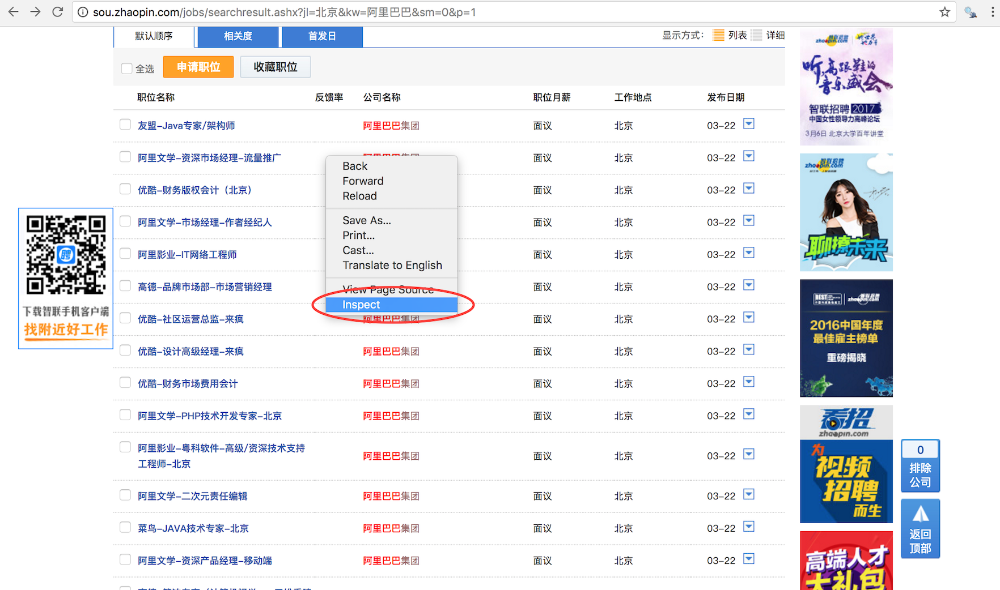
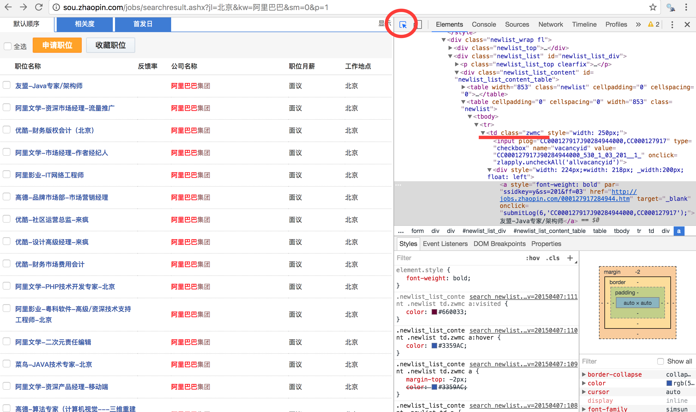

```{r setup, include=FALSE}
knitr::opts_chunk$set(echo = TRUE, message = FALSE)
```

# In this lecture we are going to learn ...

- Text processing in **R**
- Web scraping in **R**
- Text mining in **R**

# Packages required in this lecture

```
install.packages(c("stringr", "rvest", "knitr", "jiebaR", "wordcloud2",
                  "tm", "slam" , "proxy", "topicmodels", "RColorBrewer"))
```

# {.alert}
<br>
<br>
Text Processing

# Read and write text data into R


```{r readlines}
# read text data into R
# WMTnews.txt can be found on my Github.
wmt.news <- readLines('WMTnews.txt')
# You can also read from the file I put online. It takes roughly 2 mins to read.
# wmt.news <- readLines("https://yanfei.site/docs/dpsa/WMTnews.txt",
#                       encoding = 'UTF-8') 
length(wmt.news)

# print the first news article without quotes
noquote(wmt.news[1])

# write text data into R
cat(wmt.news, file = "WMTnews.txt", sep = "\n")
```

- You may use other functions like `read.table()`, `write.table()` etc.


# Length of each article

- `nchar()`
- `stringr::str_length()`

```{r nchar}
# number of characters in each news article
nchar(wmt.news)
# library(stringr); str_length(wmt.news)
```

# Concatenate strings

#### Concatenate two strings

- `paste()`
- `stringr::str_c()`

```{r paste}
# concatenate characters 
paste('2015', '06-04', sep = '-')
paste('2015', c('06-04', '06-05'), sep = '-')
paste('2015', c('06-04', '06-05'), sep = '-', collapse = ' ')

# str_c() in stringr
library(stringr)
str_c('2015', '06-04', '00:00', sep = '-')

# frequently used in web scraping
paste('http://sou.zhaopin.com/jobs/searchresult.ashx?jl=北京&kw=', 
      '阿里巴巴', sep = '')
paste('http://sou.zhaopin.com/jobs/searchresult.ashx?jl=', 
      '上海', '&kw=', '阿里巴巴', sep = '')
```

#### Combine text and variable values
- `sprintf()` is a superior choice over paste.
```{r sprintf}
# combine text and variable values
comp <- '阿里巴巴'
job.location <- '上海'
sprintf('http://sou.zhaopin.com/jobs/searchresult.ashx?jl=%s&kw=%s',
        job.location, comp)
```

# Split strings

- `strsplit()`
- `stringr::str_split()`
```{r strsplit}
# split characters
dates <- c('2015-06-04', '2015-06-05')
strsplit(dates, "-")
strsplit('2015-06-04', '-')

# another way
library(stringr)
str_split(dates, '-')
str_split('2015-06-04', '-')
```


# Pattern Matching
```{r strmatch}
# search for matches
mySentences <- c('沃尔玛还与微信跨界合作，顾客可通过沃尔玛微信服务号的付款功能在实体门店秒付买单。', 
                 '沃尔玛移动支付应用已经部署在其全美4,600家超市中。')
grep('沃尔玛', mySentences)
grepl('沃尔玛', mySentences)
library(stringr); str_detect(mySentences, '沃尔玛')
regexpr('沃尔玛', mySentences)
gregexpr('沃尔玛', mySentences)
```


# Pattern Replacement
```{r sub}
# replace white spaces 
messySentences <- c('沃尔玛还与微信   跨界合作，顾客可通过沃尔玛微信服务号的付   款功能在实体门店秒付买单。', 
                    '沃尔玛移动支付应 用已经部  署在其全美4,600家超市中。')

# patten replacement
# sub(pattern, replacement, x, ...)
sub(' ', '', messySentences)

# gsub(pattern, replacement, x, ...)
gsub(' ', '', messySentences)
```

# Extract substrings in a character vector

```{r substr}
# extract substrings: substr(x, start, stop)
x <- c('月薪：5000元', '月薪：8000元')
substr(x,4,7)
```

# Your turn (1) 💓

1. Load text from the https://yanfei.site/docs/dpsa/BABAnews.txt and print it on screen. Text file contains some of the news of Alibaba.

2. How many paragraphs are there in the article?

3. Trim leading whitespaces of each paragraph (try `??trim`).

4. How many characters are there in the article?

5. Collapse paragraphs into one and display it on the screen (un-list it).

6. Does the text contain word '技术架构'?

7. Split the article into sentences (by periods).

8. Replace '双11' with '双十一'.

<!-- 8. Create a function that takes a string and returns it in reversed order by words (Hint: split the string according to a blank space ` '. Then count the number of components resulting from the splitting step. Re-arrenge them in reverse order and paste them in a single string.) -->

# Answer (1)

```{r, eval = FALSE}
# 1
baba.news <- readLines("https://yanfei.site/docs/dpsa/BABAnews.txt",
                       encoding = 'UTF-8')
noquote(baba.news)

# 2
length(baba.news)

# 3
baba.news <- str_trim(baba.news)

# 4
nchar(baba.news)

# 5
baba.news.collapsed <- paste(baba.news, collapse = "")
cat(baba.news.collapsed)

# 6
grepl("技术架构", baba.news.collapsed)
grep('技术架构', baba.news)

# 7
strsplit(baba.news.collapsed, "。")

# 8
gsub("双11", "双十一", baba.news.collapsed)
```

# Reference and further reading 

Please see [Text processing on Wiki](https://en.wikibooks.org/wiki/R_Programming/Text_Processing) for more details, examples, **R** packages and **R** functions used for text processing in **R**.


# {.alert}
<br>
<br>
Web Scraping


# We need data

- Data is messy!


- But we want a tidy format of data!
    + rows == observations 
    + columns == attributes
    

| Movie         | Score          |Length (mins)   |Language         |
| ------------- |:-------------: |:-------------: | :-------------: | 
| 爱乐之城      | 8.4            | 128            |English          |
| 看不见的客人  | 8.7            | 106            |Spanish          |
| ...           | ...            |...             |  ...            | 

# Get familiar with the structure of a html (tags)

- When we do web scraping, we deal with html tags to find the path of the information we want to extract.

- A simple html source code: tree structure of html tags. HTML tags normally come in pairs.
    
```
<!DOCTYPE html>
<html>
  <title> My title
  </title>
  <body>
    <h1> My first heading </h1>
      <p> My first paragraph </p>
  </body>
</html>
```

- `<!DOCTYPE html>` : HTML documents must start with a type declaration
- HTML document is contained between `<html>` and `</html>`
- The visible part of the HTML document is between `<body>` and `</body>`
- HTML headings are defined with the `<h1>` to `<h6>` tags
- HTML paragraphs are defined with the `<p>` tag

# Work with other useful tags

- HTML links are defined with the `<a>` tag
```
<a href="http://www.test.com">This is a link for test.com</a>
```
- HTML tables are defined with `<table>`, row as `<tr>` and rows are divided into data as `<td>`
```
<table style="width:100%">
  <tr>
    <td> 中文名称 </td>
    <td> 英文名称 </td>
    <td> 简称     </td>
  </tr>
  <tr>
    <td> 北京航空航天大学 </td>
    <td> Beihang University </td>
    <td> 北航 </td>
  </tr>   
</table>
```

- HTML list starts with `<ul>` (unordered) and `<ol>` (ordered). Each item of list starts with `<li>`
```
<ol>
  <li> 科技获奖 </li>
  <li> 服务国家战略 </li>
  <li> 标志性成果 </li>
</ol>
```

You can try http://www.tryiteditor.com to learn more about html. 

# XPath

- Path used to select nodes and info in html. Here are some examples of XPath expressions and their meanings. XPath is one of the most crucial step to do web scraping.

#### Example 1
```
<!DOCTYPE html>
<html>
  <title> My title
  </title>
  <body>
    <h1> My first heading </h1>
      <p> My first paragraph </p>
  </body>
</html>
```
- **`/html/title`**: selects the `<title>` element of an HTML document 
- **`//p`**: selects all the `<p>` elements

#### Example 2
```
<html> 
  <head>
    <base href='http://example.com/' />
    <title>Example website</title> 
  </head>
  <body>
    <div id='images', class='img'>
      <a href='image1.html'>Name: My image 1 <br /></a> 
      <a href='image2.html'>Name: My image 2 <br /></a> 
      <a href='image3.html'>Name: My image 3 <br /></a> 
      <a href='image4.html'>Name: My image 4 <br /></a> 
      <a href='image5.html'>Name: My image 5 <br /></a>
    </div> 
    <div>
      <a href='img.html'> text </a>
    </div>
  </body>
</html>
```
- **`//div[@id="images"]`**: selects all the `<div>` elements which contain an attribute `id="images"`. Note its difference with `//div`
    - **`//div[@class="img"]`** 
    - **`//body/div[1]`** 
    - Xpath is not unique. 
    - attributes like 'class' and 'id' are mostly used.
    
- **`//div[@id="images"]/a/`**: selects all the `<a>` elements inside the aforementioned element.


# Your turn (2) 💓


```
<td class="zwmc" style="width: 250px;">
  <div style="width: 224px;*width: 218px; _width:200px; float: left">
    <a style="font-weight: bold">金融分析师</a>
  </div>
</td>
```

> - Q: Please extract the `<a>` element from the source above.
> - A1: `//td[@class="zwmc"]/div/a`
> - A2: `//td[@class="zwmc"]//a`


# Where to go?

Scrape job information from http://sou.zhaopin.com of jobs related to '阿里巴巴'.

- Inspect a web page (easily found in Chrome).

<center></center>

- Find the xpath for the elements you want to extract
    - E.g., xpath for job titles: `//td[@class="zwmc"]/div/a`.
    - You can also find xpath from viewing the whole page source
<center></center>

# Your turn (3) 💓

Can you find xpath for companies, salaries, locations and links?


#  Scrapping a webpage using **rvest** package


- Parse the entire website: `read_html()`.
- Find and extract the pieces of the website you need using XPath: `html_nodes()`. It pull out the entire node.
- The following are done after using html_nodes() to extract content we need.
    - `html_table()`:  extract all data inside a html table.
    - `html_text()`:  extract all text within the node.
    - `html_attr()`: extract contents of a single attribute.
    - `html_attrs()`: extract all attributes. 
- Cleanup

# Go back to previous examples

```{r}
library(rvest)
web <- read_html('<!DOCTYPE html>
<html>
  <title> My title
  </title>
  <body>
    <h1> My first heading </h1>
      <p> My first paragraph </p>
  </body>
</html>')
title_node <- html_nodes(web, xpath = '//title')
title_node
html_text(title_node)
str_trim(html_text(title_node))
```


# Let's do it!

#### Now we want to scrape data from a html table

```{r wiki1, cache = TRUE}
url <- "https://en.wikipedia.org/wiki/Provinces_of_China"
web <- read_html(url)
provinces_nodes <-
  html_nodes(web, xpath = '//*[@class="wikitable sortable"]')
provinces <- html_table(provinces_nodes)
library(knitr)
kable(head(provinces[[1]]), format = "html")
```

# Let's do it!

#### Now let's scrape data from a list

```{r wiki2, cache = TRUE}
url <- "https://en.wikipedia.org/wiki/Provinces_of_China"
web <- read_html(url)
references_nodes <-
  html_nodes(web, xpath = '//div[@class="reflist"]//li')
references <- html_text(references_nodes)
references
```

# Let's do it!

#### Now let's scrape some employment data

```{r zhilian0, cache=TRUE}
library(rvest)
url <- 'http://sou.zhaopin.com/jobs/searchresult.ashx?jl=北京&kw=阿里巴巴'
web <- read_html(url)
job_title_nodes <- html_nodes(web, xpath = '//td[@class="zwmc"]/div/a')
length(job_title_nodes)
job_title <- html_text(job_title_nodes)
job_title[1:5]
link <- html_attr(job_title_nodes, 'href')
link[1:5]
```

# Pipeable!

```
job_title_nodes <- html_nodes(web, xpath = '//td[@class="zwmc"]/div/a')
job_title <- html_text(job_title_nodes)
```

$\Downarrow$

```
job_title <- web %>%
  html_nodes(xpath = '//td[@class="zwmc"]/div/a') %>%
  html_text()
```

# Let's extract as much information as we can

### Extract job title, company, salary, location and link

```{r zhilian1, cache=TRUE}
library(rvest)
url <- 'http://sou.zhaopin.com/jobs/searchresult.ashx?jl=北京&kw=阿里巴巴'
web <- read_html(url, encoding = "utf-8")
job_title <- web %>%
  html_nodes(xpath = '//td[@class="zwmc"]/div/a') %>%
  html_text()
link <- web %>%
  html_nodes(xpath = '//td[@class="zwmc"]/div/a') %>%
  html_attr('href')
# link = paste('[Link](', link, sep='')
# link <- paste(link, ')', sep='')
company <- web %>%
  html_nodes(xpath = '//td[@class="gsmc"]') %>%
  html_text()
salary <- web %>%
  html_nodes(xpath = '//td[@class="zwyx"]') %>%
  html_text()
location <- web %>%
  html_nodes(xpath = '//td[@class="gzdd"]') %>%
  html_text()
alibaba_jobs <- data.frame(job_title, company, salary, location, link)
library(knitr)
kable(head(alibaba_jobs), format = "html")
```

# How to turn page?

Think about how to turn pages?


# Let's extract as much information as we can

### Extract more job details via its link

```{r zhilian2, cache=TRUE}
library(stringr)
get_job_detail <- function(link){
  link = as.character(link)
  web = read_html(link)
  experience = web %>%
    html_nodes(xpath = '//ul[@class="terminal-ul clearfix"]/li[5]/strong') %>%
    html_text()
  degree = web %>%
    html_nodes(xpath = '//ul[@class="terminal-ul clearfix"]/li[6]/strong') %>%
    html_text()
  number = web %>%
    html_nodes(xpath = '//ul[@class="terminal-ul clearfix"]/li[7]/strong') %>%
    html_text()
  description = web %>%
    html_nodes(xpath = '//div[@class="terminalpage-main clearfix"]/div/div[1]')%>%
    html_text()
  description = sub('查看职位地图', '', description)
  description = sub('工作地址：', '', description)
  description = sub('北京', '', description)
  description = str_trim(description)
  link_details = data.frame(experience, degree, number, description)
  return(link_details)
}

job_details <- data.frame()
for (i in 1:nrow(alibaba_jobs)){
  job_details = rbind(job_details, get_job_detail(alibaba_jobs$link[i]))
}
alibaba_job_details <- cbind(alibaba_jobs, job_details)
kable(head(subset(alibaba_job_details, select = -description)), format = "html")
```


# Your turn (4) 💓

Please choose one from the following exercises.

<!-- - Extract names, research interests, emails and links  of all BUAA SEM Professors (http://sem.buaa.edu.cn/szdw/jsbd.htm) -->

<!-- - Extract at least 5 attributes of the movies listed on Douban top 250 (https://movie.douban.com/top250) -->

<!-- - Extract the top 5 pages of hotel information including the newest reviews from TripAdvisor (https://www.tripadvisor.com/Hotels-g294212-Beijing-Hotels.html) -->

<!-- - Extract the top 5 pages of book information from Amazon (https://www.amazon.cn/s/ref=nb_sb_noss?__mk_zh_CN=亚马逊网站&field-keywords=大数据) -->


- Extract at least 5 attributes of the books listed on Douban top 250 (https://book.douban.com/top250) 

- Extract at least 5 pages of news articles about '阿里巴巴' by searching for its name on sina news (http://search.sina.com.cn)

- Extract the top 5 pages of hotel information including the newest reviews from TripAdvisor (https://www.tripadvisor.com/Hotels-g294212-Beijing-Hotels.html) 

- Extract the top 5 pages of book information from Amazon (https://www.amazon.cn/s/ref=nb_sb_noss?__mk_zh_CN=亚马逊网站&field-keywords=大数据) 


# About assignments

1. Subject of your email: "DPSA_姓名_学号"
2. You'd better describe what you did in the body of the email and let me know the questions or problems you have.
3. Email attachments:
    1. DPSA_姓名_学号.R
    2. DPSA_姓名_学号.csv

<!-- # Resubmit your assignment -->

<!-- Improve your assignments and resubmit.  -->

<!-- 1. Subject: "DPSA_R1_姓名_学号" -->
<!-- 2. Describe what you have improved in the new version -->
<!-- 3. Attachements: -->
<!--     1. DPSA_R1_姓名_学号.R -->
<!--     2. DPSA_R1_姓名_学号.csv -->


    
    

<!-- # Answer (4) -->

<!-- ```{r} -->
<!-- # buaa sem professors -->
<!-- web %>%  -->
<!--   html_nodes(xpath = "//div[@class=\"fak-list\"]//tr/td[2]/span")%>% -->
<!--   html_text() -->

<!-- web %>%  -->
<!--   html_nodes(xpath = "//div[@class=\"fak-list\"]//tr//a") %>% -->
<!--   html_attr("href") -->

<!-- # Amazon book information -->
<!-- web %>%  -->
<!--   html_nodes(xpath = '//a[@class="a-link-normal s-access-detail-page  s-color-twister-title-link a-text-normal"]') %>%  -->
<!--   html_attr('href') -->

<!-- # TripAdvisor -->
<!-- web %>% -->
<!--   html_nodes(xpath='//div[@class="listing_title"]/a') %>% -->
<!--   html_attr('href') -->
<!-- ``` -->


# Some notes

- When you scrape a website too frequently, the server may reject your request. One possible solution is to stop for several seconds irregularly.

- Not every website is scrappable! Some websites go with really high technoloy to protect their data from being extracted. For example, they use javascript, or really complex captcha codes.

- Python has more functionality for web scraping. It is more flexible to deal with the problems mentioned above. If you are interested in that, please refer to [this book](https://yanfei.site/docs/dpsa/references/PyWebScrapingBook.pdf). Basics of web scraping with Python are similar.

#{.alert}
<br>
<br>
Text Mining

# What is text mining?

## Raw human written text $\Rightarrow$ Structured information

- The biggest difference between text mining and general data analysis is that it deals with text data, instead of numeric values. 
- Sometimes text mining is called 'Natural Language Processing (NLP)', especially in computer science.
- Most text mining methods are based on word frequency in real world.

# We are going to focus on ...

- Corpus
    - a collection of documents (e.g., a collection of different job description documents)
- Word segment
    - segment each text into words
    - stopwords: common words that generally do not contribute to the meaning of a sentence, at least for the purposes of information retrieval and natural language processing. These are words such as the and a. Most search engines will filter out stopwords from search queries and documents in order to save space in their index.
- DocumentTermMatrix
    - Each row is a document, while each column shows word frequencies of the corresponding word.
    - This is the very basic data structure for text mining.
- Text clustering
    - Group similar documents together according to their similarities.
- Topic models
    - Find topics which the corpus is talking about.


# Case study: job description corpus

```{r loaddata}
# read text data into R
alibaba_job_description <- as.character(alibaba_job_details$description)
```


# Word segment

```{r segment, cache=TRUE}
# load the word segment package
library(jiebaR)
# build a segment engine
engine1 <- worker(stop_word = 'stopwords.txt')
# add news words into the engine 
new_user_word(engine1, c("新技术", '新媒体'))

# for each job description, perform word segmentation
Words <-  c()
for(i in 1:length(alibaba_job_description)){
  Words <- c(Words,c(segment(alibaba_job_description[i], engine1)))
}

# we need to consider other stopwords in this specific case
myStopwords <- c('工作', '地址', '公司', '岗位', '描述', 
                 '负责', '职位', '年', '优先', '具备',
                 '熟悉','相关')
Words <- Words[-which(Words %in% myStopwords)]

# remove all the numbers
Words <- gsub("[0-9]+?",'', Words)

# only keep terms
Words <- Words[nchar(Words) > 1]
head(Words)
```


# Word frequency and wordcloud
```{r wordfreq}
# word frequencies
wordsNum <- table(unlist(Words))  
wordsNum <- sort(wordsNum, decreasing = TRUE)   
words.top150 <- head(wordsNum,150) 
library(RColorBrewer); colors <- brewer.pal(8,"Dark2")  
# Sys.setlocale("LC_CTYPE")
library(wordcloud2)
wordcloud2(words.top150, color = "random-dark", shape = 'circle', backgroundColor = 'white')
# letterCloud(words.top150, word= "A", color = "random-light",
#             backgroundColor = "white",size = 0.3)
```

# What tools are required?
```{r tools}
toolsNum <- wordsNum[substr(names(wordsNum),1,1)%in%  c("A","B","D","E","F","G","H","I","J","K","L","M","N","O","P","Q","R","S","T","U","V","W","X","Y","Z")]
tools.top50 <- head(toolsNum, 50) 
my.english.stopwords <- c('IN', 'OF', 'TO', 'AND', 'WITH', 'FOR', 
                          'THE', 'WORKING', 'WORK')
tools.top <- tools.top50[!(names(tools.top50) %in% my.english.stopwords)]
wordcloud2(tools.top, color = "random-dark", shape = 'circle', backgroundColor = 'white')
```

# Clustering
```{r clustering, cache=TRUE}
# load the text mining packages
library(tm)
library(slam)
wmt.news <- readLines("WMTnews.txt") 
# wmt.news <- readLines("https://yanfei.site/docs/dpsa/WMTnews.txt", encoding = 'UTF-8')

# build word segment engine
mixseg <- worker(stop_word = "stopwords.txt")
# mixseg <- worker(stop_word = "https://yanfei.site/docs/dpsa/stopwords.txt")
mixseg$bylines <- TRUE

# word segmentation for each of the 449 articles
word_list <- mixseg[wmt.news]

f <- function(x){
  x <- gsub("[0-9]+?",'', x)
  x[x == '号店'] <- '1号店'
  x <- paste(x[nchar(x) > 1], collapse = ' ')
  return(x)
}
# cleanup
d.vec <- lapply(word_list,f)
corpus <- Corpus(VectorSource(d.vec))

# remove stopwords
myStopwords <- c('新浪', '沃尔玛', '年',  '月', '日','公司', '中国', '有限公司')
stopwords <- readLines('stopwords.txt')
mycorpus <- tm_map(corpus,removeWords,c(stopwords, myStopwords))

# creat DocumentTermMatrix
control <- list(removePunctuation=T, 
             wordLengths = c(2, Inf), 
             stopwords = c(stopwords, myStopwords))
d.dtm <- DocumentTermMatrix(mycorpus, control)
d.dtm <- d.dtm[row_sums(d.dtm)!=0, ]

# remove sparse ones
d.dtm.sub <- removeSparseTerms(d.dtm, sparse = 0.99)

# text clustering
library(proxy)
d.dist <- proxy::dist(as.matrix(d.dtm.sub), method='cosine')
fit <- hclust(d.dist, method="ward.D")
memb <- cutree(fit, k = 2)
plot(fit)
```

# Clustering
```{r clustering2, cache=TRUE}
findFreqTerms(d.dtm.sub[memb==1, ], 300)
findFreqTerms(d.dtm.sub[memb==2, ], 300)
```


# Topic models
```{r topicmodeling, cache=TRUE}
library(topicmodels)
ctm <- topicmodels::CTM(d.dtm.sub, k = 2)
terms(ctm, 2, 0.01)
```

# References 

- [Wikibooks on text processing](https://en.wikibooks.org/wiki/R_Programming/Text_Processing)
- [`rvest` package documentation](https://cran.r-project.org/web/packages/rvest/rvest.pdf)
- [`jiebaR` tutorial](http://qinwenfeng.com/jiebaR/)

# Further readings

- Other **R** packages like `XML`, `RCurl` and `scrapeR` are also used for web scraping.
- Other packages for text mining can be found [here](https://cran.r-project.org/web/views/NaturalLanguageProcessing.html).
- [Web Scraping with Python](https://yanfei.site/docs/dpsa/references/PyWebScrapingBook.pdf)
