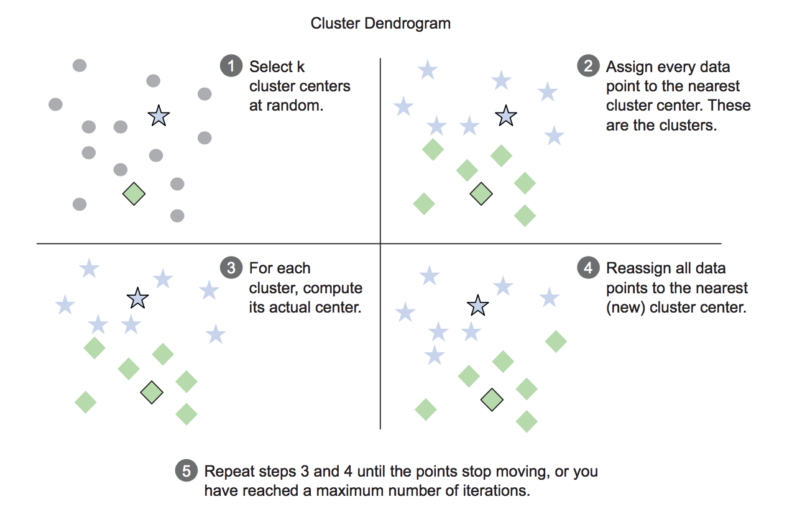

```{r setup, include=FALSE}
knitr::opts_chunk$set(echo = TRUE, fig.align = 'center', warning = FALSE, message = FALSE)
```

#  In this lecture we are going to learn...

- Principal component analysis (PCA)
- Cluster analysis


# {.alert}
<br>
<br>
PCA

# Why PCA?

In PCA, the dataset is transformed from its original coordinate system to a new coordinate system. The first new axis is chosen in the direction of the most variance in the data. The second axis is orthogonal to the first axis and in the direction of an orthogonal axis with the largest variance. The majority of the variance is often contained in the first few axes. Therefore, we can ignore the rest of the axes, and we reduce the dimensionality of our data. 

Therefore, PCA is often used for:

1. Dimension reduction

2. Data visualisation for multivariate data


# Case study: PCA

Check out the details about the  dataset we will use (`?BreastCancer`).

```{r pca}
library(mlbench)
data("BreastCancer")
breast.cancer.raw = BreastCancer[complete.cases(BreastCancer),]
breast.cancer.data = subset(breast.cancer.raw, select = -c(Id, Class))
scaled.breast.cancer.data = scale(sapply(breast.cancer.data, as.numeric))
breast.cancer.pc.cr <- princomp(scaled.breast.cancer.data)
breast.cancer.PC1 <- breast.cancer.pc.cr$scores[, 1]
breast.cancer.PC2 <- breast.cancer.pc.cr$scores[, 2]
summary(breast.cancer.pc.cr)
breast.cancer.pc.cr$loadings
library(ggplot2)
qplot(breast.cancer.PC1, breast.cancer.PC2)
bc.class <- as.factor(breast.cancer.raw$Class)
qplot(breast.cancer.PC1, breast.cancer.PC2, col = bc.class)
```

# {.alert}
<br>
<br>
Cluster analysis

# Motivation

- In cancer research for classifying patients into subgroups according their gene expression profile. This can be useful for identifying the molecular profile of patients with good or bad prognostic, as well as for understanding the disease.

- In marketing for market segmentation by identifying subgroups of customers with similar profiles and who might be receptive to a particular form of advertising.

- In City-planning for identifying groups of houses according to their type, value and location.


# Clustering analysis

- Partitioning Clustering ($k$-means or pam-partitioning around medoids, etc.)
    - E.g.,$k$-means clustering - aims to partition n observations into k clusters in which each observation belongs to the cluster with the nearest mean.
<center></center>

- Hierarchical Clustering 
    1. Agglomerative: This is a "bottom up" approach: each observation starts in its own cluster, and pairs of clusters are merged as one moves up the hierarchy.
    2. Divisive: This is a "top down" approach: all observations start in one cluster, and splits are performed recursively as one moves down the hierarchy.
    
- Others like spectral clustering etc.


# $k$-means clustering
#### Breast cancer data again

```{r km}
library(ggfortify)
set.seed(1)
km.breast.cancer <- kmeans(scaled.breast.cancer.data, 2)

# visualizing clusters using pca
Cluster <- as.factor(km.breast.cancer$cluster)
qplot(breast.cancer.PC1, breast.cancer.PC2, col = Cluster)
```

# Hierachical clustering

You do not need to specify $k$ before clustering. 

<!-- - The `hclust()` function takes as input a distance matrix, which records the distances between all pairs of points in the data.  -->
<!-- - Returns a dendrogram: a tree that represents the nested clusters.   -->
<!-- - `dist()` will calculate distance functions using the (squared) Euclidean distance, the Manhattan distance, and something else (see `help(dist)` for further details). -->

```{r hc}
hc.breast.cancer <- hclust(dist(scaled.breast.cancer.data))
hc.cluster <- cutree(hc.breast.cancer, k = 2)
plot(hc.breast.cancer,hang = -1, cex = 0.6)
rect.hclust(hc.breast.cancer, k = 2, border = "red")
```

# A practical issue: picking the number of clusters

- What value should $k$ take? It's best to take advantage of domain knowledge.
- In the absence of a subject-matter knowledge, try a variety of heuristics, and perhaps a few different values of $k$. Eg: 
    - The Calinski-Harabasz index of a clustering is the ratio of the between-cluster variance to the total within-cluster variance.

- R offers various empirical approaches for selecting a value of $k$. One such R tool for suggested best number of clusters is the **NbClust** package.

# Clustering takeaways

1. In a good clustering, points in the same cluster should be more similar (nearer) to each other than they are to points in other clusters.

2. Ideally, you want a unit change in each coordinate to represent the same degree of change. One way to approximate this is to transform all the columns to have a mean value of 0 and a standard deviation of 1.0, for example by using the function `scale()`.

3. Clustering is often used for data exploration. But you may want to use the clusters that you discovered to categorize new data, as well. 

4. Different clustering algorithms will give different results. You should consider different approaches, with different numbers of clusters.

5. There are many heuristics for estimating the best number of clusters. Again, you should consider the results from different heuristics and explore various numbers of clusters.

# Case Study: Global Happiness

- **Motivation: ** illustrate the applications of web scraping, dimension reduction and applied clustering tools in R.
- Two parts of **data** to scrape from internet: 
    - The World Happiness Report 2017 (https://en.wikipedia.org/wiki/World_Happiness_Report)
    - The 2015 social progress index of countries (https://en.wikipedia.org/wiki/List_of_countries_by_Social_Progress_Index)
- **Our goal: ** segment rows of the over 150 countries in the data into separate groups (clusters)

# Web Scraping
```{r, cache=TRUE}
library(rvest)
url1 <- "https://en.wikipedia.org/wiki/World_Happiness_Report"
happy <- read_html(url1) %>% 
        html_node("table") %>% 
        html_table()

# inspect imported data structure 
str(happy)

### scrape social progress index data report from the site
url2 <- "https://en.wikipedia.org/wiki/List_of_countries_by_Social_Progress_Index"
social <- read_html(url2) %>% 
     html_nodes("table") %>% 
     .[[2]] %>% 
     html_table(fill=T)
# check imported data structure 
str(social)
```

# Data Pre-processing
```{r}
## Exclude columns with ranks and scores, retain the other columns
happy <- happy[c(3,6:11)]
### rename column headers 
colnames(happy) <- gsub(" ", "_", colnames(happy), perl=TRUE)

### standardize names of selected countries to confirm with country names in the the map database 
library(plyr)
happy$Country <- as.character(mapvalues(happy$Country, from = c("United States", "Congo (Kinshasa)", "Congo (Brazzaville)", "Trinidad and Tobago"),to = c("USA","Democratic Republic of the Congo", "Democratic Republic of the Congo", "Trinidad")))
names(happy)

### Again, exclude columns with ranks, keep the rest
social <- social[c(1,5,7,9)]
### rename column headers 
names(social) <- c("Country", "basic_human_needs", "foundations_well_being", "opportunity")

### Standardize country names to confirm with country names in the map dataset 
social$Country <- as.character(mapvalues(social$Country, from = c("United States", "Côte d'Ivoire","Democratic Republic of Congo", "Congo", "Trinidad and Tobago"), to=c("USA", "Ivory Cost","Democratic Republic of the Congo", "Democratic Republic of the Congo", "Trinidad")))

## coerce character data columns to numeric
social[, 2:4] <- sapply(social[, 2:4], as.numeric)
names(social)
```

# Join two datasets
```{r}
### perform left join
library(dplyr)
soc.happy <- left_join(happy, social, by = c('Country' = 'Country'))
### check for missing values in the combined data set
mean(is.na(soc.happy[, 2:10]))
```

# Data Pre-processing
####  Dealing with missing values

```{r}
### median imputation
for(i in 1:ncol(soc.happy[, 2:10])) {
        soc.happy[, 2:10][is.na(soc.happy[, 2:10][,i]), i] <- median(soc.happy[, 2:10][,i], na.rm = TRUE)
}
### summary of the raw data
#summary(soc.happy[,2:10])
```

#### Data transformation

An important procedure for meaningful clustering and dimension reduction steps involves data transformation and scaling variables. 

```{r}
## transform variables to a range of 0 to 1
soc.happy[,2:10] <- as.data.frame(scale(soc.happy[,2:10]))

### summary of transformed data shows success of transformation
#summary(soc.happy[,2:10])
names(soc.happy)
```

# Simple correlation analysis
```{r}
library(corrplot)
corrplot(cor(soc.happy[, 2:10]), addCoef.col = "grey")
```

# PCA
```{r}
soc.pca <- princomp(soc.happy[, 2:10])
soc.PC1 <- soc.pca$scores[, 1]
soc.PC2 <- soc.pca$scores[, 2]
summary(soc.pca)
soc.pca$loadings
library(ggplot2)
qplot(soc.PC1, soc.PC2)
```

# Clustering
#### Choose the number of clusters
```{r, cache=TRUE}
library(NbClust)
nbc <- NbClust(soc.happy[, 2:10], distance="manhattan", min.nc=2, max.nc=30, method = 'ward.D', index = 'all')
```

# Clustering
#### pam
Partitioning (clustering) of the data into $k$ clusters "around medoids", a more robust version of $K$-means.

```{r}
# pam
library(cluster)
km.soc <- pam(soc.happy[,2:10], 3)
Cluster <- as.factor(km.soc$cluster)
qplot(soc.PC1, soc.PC2, col = Cluster) 
soc.happy['cluster'] <- Cluster
table(Cluster)

# what does each cluster mean
km.soc$medoids

# and which countries were typical of each cluster
soc.happy$Country[km.soc$id.med]
```


# Visualisation on world map
```{r, fig.width=12, fig.height=8}
map.world <- map_data("world")
# LEFT JOIN
map.world_joined <- left_join(map.world, soc.happy, by = c('region' = 'Country'))
ggplot() +
  geom_polygon(data = map.world_joined, aes(x = long, y = lat, group = group, fill=cluster, color=cluster)) +
  labs(title = "Applied Clustering World Happiness and Social Progress Index",
       subtitle = "Based on data from:https://en.wikipedia.org/wiki/World_Happiness_Report and 
       https://en.wikipedia.org/wiki/List_of_countries_by_Social_Progress_Index", 
       x=NULL, y=NULL) +
  theme(plot.title = element_text(hjust = 0.5), plot.subtitle = element_text(hjust = 0.5)) +
  coord_equal() +
  theme(panel.grid.major=element_blank(),
        panel.grid.minor=element_blank(),
        axis.text.x=element_blank(),
        axis.text.y=element_blank(),
        axis.ticks=element_blank(),
        panel.background=element_blank()
  )
```


# References

1. Nina Zumel and John Mount (2014). Data Science with R. Manning.
2. https://datascienceplus.com/web-scraping-and-applied-clustering-global-happiness-and-social-progress-index/